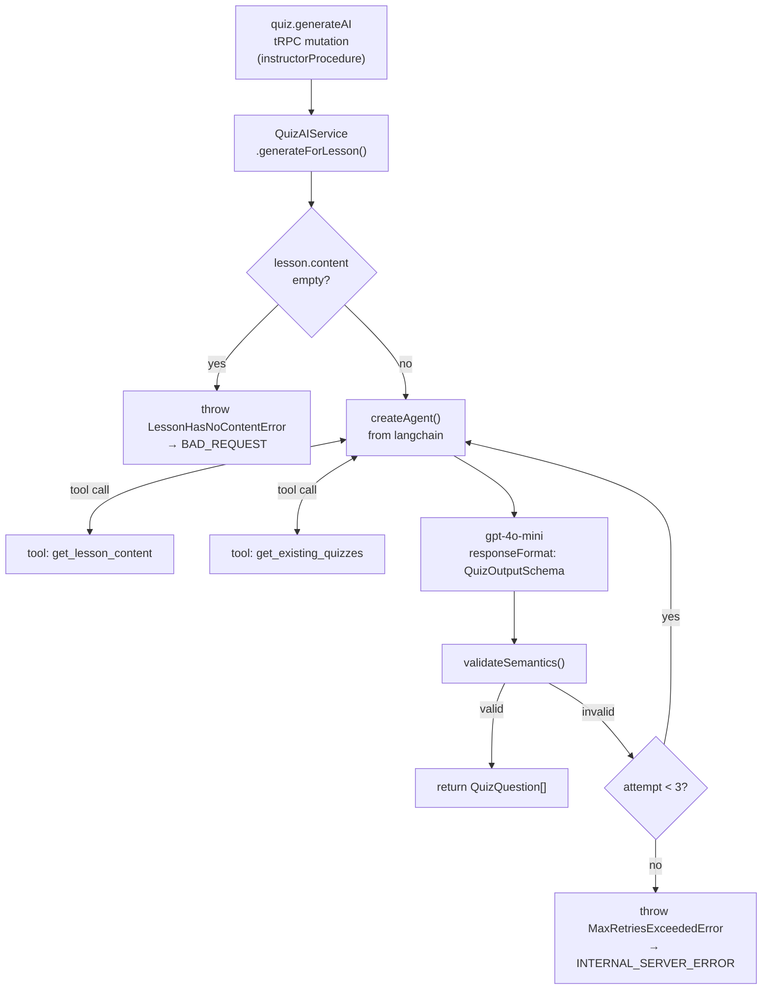
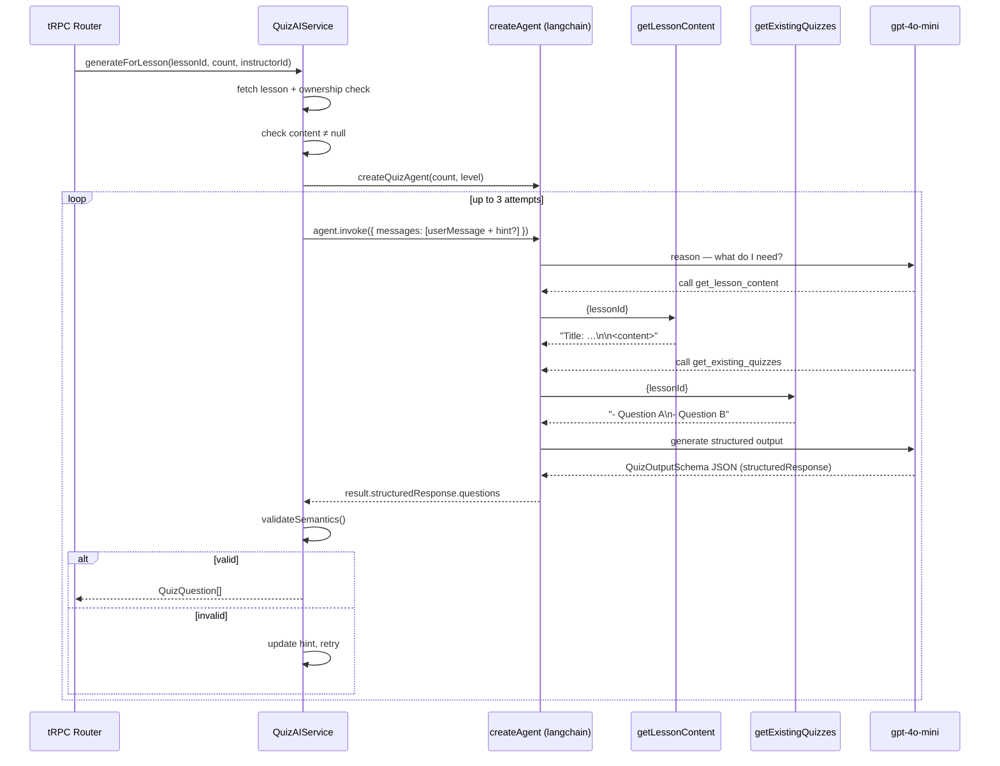

# Design: Group 5 — AI Quiz Generation (Service Layer)

## Overview

A LangChain agent reads lesson content and existing quiz questions via two
read-only tools, then produces 3–5 structured multiple-choice questions through
`gpt-4o-mini` with `responseFormat`. The service manages a bounded retry loop
(max 3 attempts) that feeds semantic validation errors back as hints so the agent
can self-correct.

---

## File Structure

```
server/services/quizAI/
├── schemas/
│   └── quizOutput.schema.ts        # Zod output schemas
├── tools/
│   ├── getLessonContent.tool.ts    # tool: reads Lesson.title + Lesson.content
│   └── getExistingQuizzes.tool.ts  # tool: reads existing Quiz rows
├── quizAI.agent.ts                 # createQuizAgent() factory
├── quizAI.service.ts               # QuizAIService.generateForLesson()
├── quizAI.validator.ts             # validateSemantics()
└── quizAI.errors.ts                # QuizAIError, MaxRetriesExceededError, LessonHasNoContentError
```

---

## Schemas

```ts
// QuizQuestionSchema
{
  question: string          // non-empty
  options:  string[]        // exactly 4 items
  correct:  string          // verbatim match of one option
}

// QuizOutputSchema
{
  questions: QuizQuestionSchema[]   // min 3, max 5
}
```

`responseFormat: QuizOutputSchema` passed to `createAgent` enforces shape at the
OpenAI layer; `validateSemantics` enforces the `correct ∈ options` invariant afterward.

---

## Architecture



---

## Data Flow (sequence)



---

## Retry Logic

```mermaid
flowchart TD
    A[agent.invoke] --> B[extract structuredResponse.questions]
    B --> C{validateSemantics\nreturns null?}
    C -->|yes| G[return QuizQuestion[]]
    C -->|no — violation msg| D[log warn, capture hint]
    D --> E{attempt < 3?}
    E -->|yes| F["retry: append hint to user message\ne.g. 'Question 2: correct not in options'"]
    F --> A
    E -->|no| H[throw MaxRetriesExceededError]
```

The `hint` string is appended to the next invocation's user message so the agent
sees its own mistake and can correct it without a full context restart.

---

## Semantic Validation Rules

`validateSemantics(questions)` in `quizAI.validator.ts` returns the first violation string or `null`.

| Rule | Violation message |
|------|------------------|
| `correct` not found in `options` | `"Question N: correct answer is not one of the options"` |
| Duplicate text within `options` of one question | `"Question N: duplicate options detected"` |
| Duplicate `question` text across the question set | `"Duplicate question text detected"` |

---

## Tools

### `get_lesson_content`

| | |
|---|---|
| **Name** | `get_lesson_content` |
| **Input schema** | `{ lessonId: string }` |
| **DB read** | `Lesson.title`, `Lesson.content` |
| **Returns (content present)** | `"Title: {title}\n\n{content}"` |
| **Returns (content null/empty)** | `"No text content found for this lesson."` |

### `get_existing_quizzes`

| | |
|---|---|
| **Name** | `get_existing_quizzes` |
| **Input schema** | `{ lessonId: string }` |
| **DB read** | all non-deleted `Quiz` rows for the lesson |
| **Returns (quizzes exist)** | one `"- {question}"` per line |
| **Returns (none)** | `"No existing questions for this lesson."` |
| **Purpose** | agent avoids regenerating questions already saved (F3) |

---

## Agent Factory

`createQuizAgent(count, level)` in `quizAI.agent.ts`:

- Uses `createAgent` from `langchain` (v1.4.0) — the replacement for the deprecated `createReactAgent` from `@langchain/langgraph/prebuilt`.
- System prompt built with `ChatPromptTemplate` (named variables `{count}`, `{level}`) per ADR-008.
- `responseFormat: QuizOutputSchema` — structured output enforced at the OpenAI layer.
- API key sourced from `env.OPENAI_API_KEY` (validated via `lib/env.js`).

```ts
createAgent({
  model: llm,                                        // ChatOpenAI gpt-4o-mini, temp 0.3
  tools: [getLessonContentTool, getExistingQuizzesTool],
  systemPrompt,                                      // formatted ChatPromptTemplate string
  responseFormat: QuizOutputSchema,
})
```

---

## System Prompt (outline)

The `ChatPromptTemplate` system message instructs the agent to:

1. Call `get_lesson_content` first — understand the material before writing questions.
2. Call `get_existing_quizzes` — never duplicate a question that already exists.
3. Produce exactly `{count}` multiple-choice questions.
4. Each question must have **exactly 4 options**; `correct` must be verbatim one of them.
5. Calibrate difficulty to the course `{level}` (Beginner / Intermediate / Advanced).
6. Output must conform to `QuizOutputSchema` — no extra keys, no markdown fences.

---

## tRPC Procedure

```ts
generateAI: instructorProcedure
  .input(QuizGenerateAIDto)   // { lessonId: string, count: 3–5, default 3 }
  .mutation(async ({ ctx, input }) => {
    return await quizAIService.generateForLesson(
      input.lessonId,
      input.count,
      ctx.session.user.id,    // ownership check inside the service
    );
  })
```

---

## Error Mapping

| Error class | tRPC code | Client receives |
|-------------|-----------|----------------|
| `QuizForbiddenError` | `FORBIDDEN` | "Lesson not found or access denied" |
| `LessonHasNoContentError` | `BAD_REQUEST` | "Lesson has no content to generate quiz from" |
| `MaxRetriesExceededError` | `INTERNAL_SERVER_ERROR` | "Generation failed, try again" |
| `QuizAIError` (base) | `INTERNAL_SERVER_ERROR` | "Generation failed, try again" |