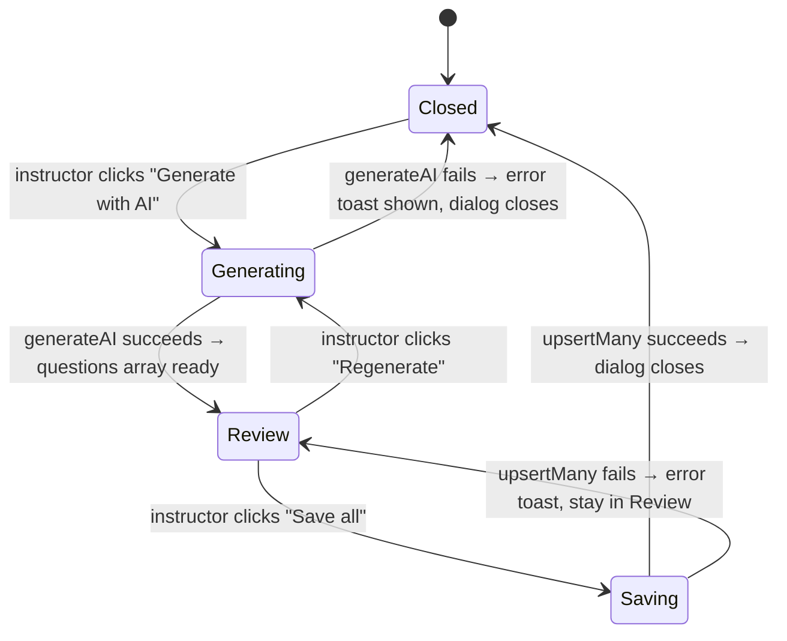
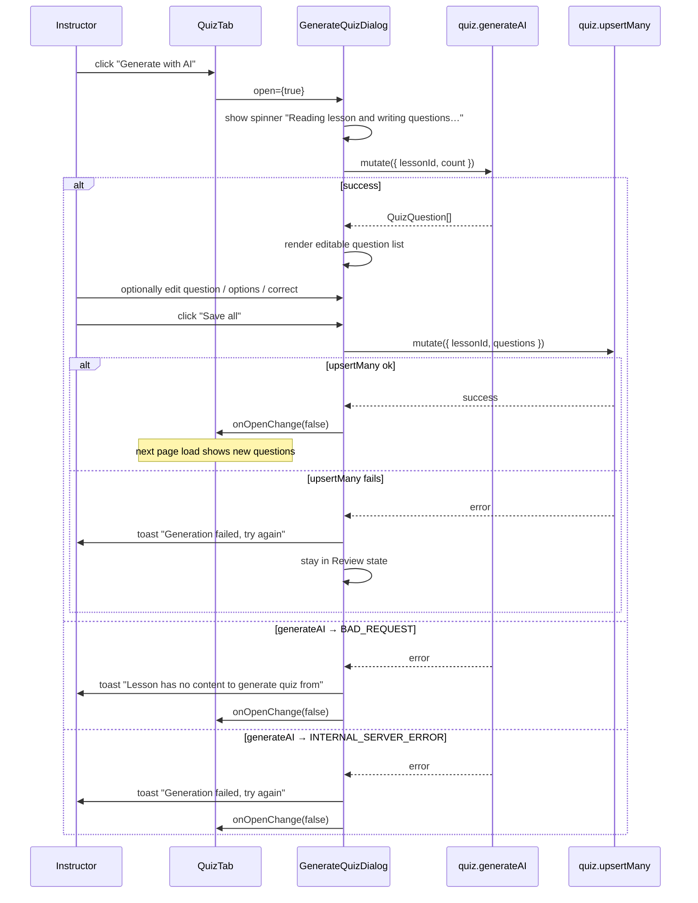

# Design: Group 6 — Generate-with-AI Dialog (UI)

## Overview

A modal dialog triggered by the "Generate with AI" button in the lesson quiz tab.
It fires the `quiz.generateAI` mutation, lets the instructor review and inline-edit
the generated questions, then atomically replaces the lesson's quiz set via
`quiz.upsertMany`. On success the dialog closes and the QuizTab state refreshes on
the next page load (no extra invalidation needed — the tab uses `initialLesson.quizzes`
from SSR, which is stale-while-acceptable for this workflow).

---

## File Structure

```
app/_components/Quiz/
└── GenerateQuizDialog/
    └── index.tsx      # GenerateQuizDialog component
```

Wired into:
```
app/_components/Course/components/Lesson/LessonContentEditor/components/QuizTab.tsx
  — replaces the disabled <span> stub added in Group 4
```

---

## UI States



---

## Full Interaction Sequence



---

## Dialog Layout (wireframe)

```
┌─────────────────────────────────────────────────────┐
│  Generate Quiz Questions                          [×] │
├─────────────────────────────────────────────────────┤
│  [Generating state]                                   │
│                                                       │
│          ⟳  Reading lesson and writing questions…    │
│                                                       │
├─────────────────────────────────────────────────────┤
│  [Review state]                                       │
│                                                       │
│  Question 1                                           │
│  ┌─────────────────────────────────────────────────┐ │
│  │ What is …?                                      │ │  ← textarea
│  └─────────────────────────────────────────────────┘ │
│  ○ [Option A input                               ]   │
│  ● [Option B input  ← correct (radio selected)  ]   │
│  ○ [Option C input                               ]   │
│  ○ [Option D input                               ]   │
│                                                       │
│  ─ ─ ─ ─ ─ ─ ─ ─ ─ ─ ─ ─ ─ ─ ─ ─ ─ ─ ─ ─ ─ ─ ─   │
│  Question 2  …                                        │
│                                                       │
│          [Regenerate]              [Save all]         │
└─────────────────────────────────────────────────────┘
```

- **Regenerate** — re-fires `generateAI`, replaces the local question list.
- **Save all** — calls `upsertMany`; button disabled while saving or if validation fails.
- **×** — closes dialog without saving; does not call any mutation.

---

## Component Props & Internal State

```ts
interface GenerateQuizDialogProps {
  lessonId:     string
  open:         boolean
  onOpenChange: (open: boolean) => void
}

// internal — no form library; local useState is sufficient
// since the list is always saved or discarded as a whole
type DialogState =
  | { phase: 'generating' }
  | { phase: 'review';    questions: EditableQuestion[] }
  | { phase: 'saving';    questions: EditableQuestion[] }

type EditableQuestion = {
  question:     string
  options:      [string, string, string, string]
  correctIndex: number   // 0–3; converted to options[correctIndex] on save
}
```

Using a local `correctIndex` (not the raw `correct` string) prevents stale
references when the instructor edits an option's text.

---

## Editable Fields Per Question

| Field | Element | Validation |
|-------|---------|-----------|
| `question` | `<textarea>` | non-empty |
| `options[0..3]` | `<input>` × 4 | each non-empty |
| correct answer | radio button per option | always one selected |

"Save all" is `disabled` until every question passes the above rules.

---

## Integration with QuizTab

`QuizTab.tsx` changes in this group:

1. Remove the `disabled` attribute and the wrapping `<span title="…">`.
2. Add local `open` state: `const [generateOpen, setGenerateOpen] = useState(false)`.
3. Render `<GenerateQuizDialog lessonId={lessonId} open={generateOpen} onOpenChange={setGenerateOpen} />`.
4. `lessonId` is passed as a new required prop from `LessonContentEditor`.

After a successful save, the instructor's in-memory `quizQuestions` state in
`useLessonEditor` is **not** patched — the next page navigation will re-fetch
`initialLesson.quizzes` from the server. This is acceptable because the typical
workflow ends with saving (no further editing in the same session).

---

## Error Handling Summary

| Scenario | Surface |
|---------|---------|
| `generateAI` → `BAD_REQUEST` | `toast.error("Lesson has no content to generate quiz from")`, dialog closes |
| `generateAI` → `INTERNAL_SERVER_ERROR` | `toast.error("Generation failed, try again")`, dialog closes |
| `upsertMany` error | `toast.error("Failed to save quiz, try again")`, stays in Review |
| All fields empty on Save | Save button disabled client-side, no request fired |