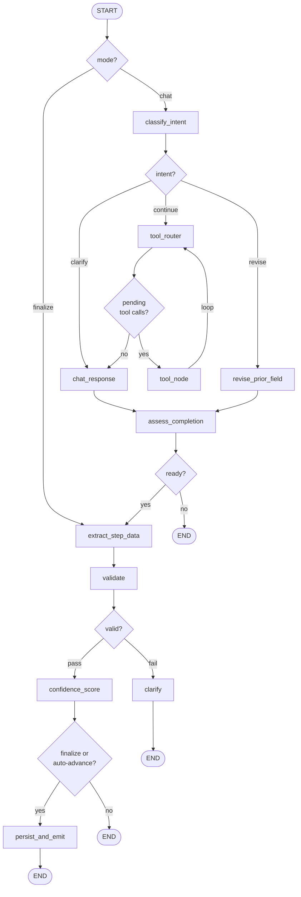

# LangGraph Course Builder — Requirements

## Problem

The AI course builder (`CourseAIService`) is a hand-rolled state machine over a four-step `DraftStep` enum (basic → objectives → requirements → curriculum). It runs two implicit chains per turn:

1. `streamChatResponse` — free-form conversation, raw `ChatOpenAI.stream()`.
2. `extractStepData` — JSON-mode extraction, validated via Zod, persisted to `CourseGeneration.content`, advances step.

This works but has structural gaps:

- No tool use. The agent cannot consult similar published courses, the instructor's prior catalog, or the project's category taxonomy. It invents categories and ignores the instructor's voice.
- No conditional branching. Validation failure throws instead of routing to a clarifying follow-up. The user must click "Accept Step" even when the data is already complete and high-confidence.
- No coherence checks. There is no validation that curriculum sections cover the stated objectives, nor that the level is consistent across fields.
- Intent is implicit. If an instructor says "actually change the level to advanced" three steps in, the system has no path to update an earlier field while preserving later progress.
- Tracing is partial. Only `extractStepData` is wrapped with `traced(…)`; the conversation path is invisible in LangSmith.

## Goal

Replace `CourseAIService`'s LCEL implementation with a single LangGraph `StateGraph` that adds:

- Tool-aware reasoning via four tools (similar courses, prior instructor courses, curriculum coherence check, category taxonomy lookup).
- Self-scored confidence that drives auto-advance through steps when the agent is ≥80% confident and validation passes.
- A revision path that lets the instructor edit earlier fields without losing later progress.
- Full per-node LangSmith tracing.

The graph runs in two modes per HTTP request: **chat mode** (terminates after streaming a response) and **finalize mode** (continues through extract / validate / confidence / persist). The mode is selected by the route handler input. The existing SSE contract is preserved for backward compatibility, with three new event types added.

No database schema changes. No LangGraph checkpointer. State is hydrated per request from `CourseGeneration` + `CourseGenerationMessage` (the existing tables).

## Functional Requirements

### Graph behavior

- FR-1. The graph SHALL classify the user's turn as `continue`, `revise`, or `clarify`. Default to `continue` if the classifier abstains.
- FR-1a. When `intent = clarify`, the graph SHALL route directly to `chat_response` (bypassing `tool_router`) and generate one focused question that resolves the ambiguity between moving forward and requesting a content change. `assess_completion` SHALL return `not_ready` for clarify turns.
- FR-2. When `intent = revise`, the graph SHALL update `content[reviseTarget]` (reviseTarget may be the current step or any earlier step), preserve all other step content, stream a short confirmation, and emit `content_revised` SSE so the preview refetches. It SHALL NOT change `currentStep`.
- FR-3. When `intent = continue`, the graph SHALL allow the model to call zero or more of the four tools before streaming a chat response.
- FR-4. In **chat mode**, after `chat_response` the graph SHALL run an `assess_completion` node — a structured-output call returning `{ decision: "ready" | "not_ready" | "ask", question?: string }`. If `decision = "ask"`, the graph SHALL route to `clarify` which streams the question. If `decision = "not_ready"`, the graph SHALL terminate without persisting.
- FR-5. If `assess_completion.decision === "ready"` in chat mode, the graph SHALL automatically continue into `extract_step_data` → `validate` → `confidence_score`. On confidence ≥ 0.8 and validation pass, it SHALL persist via `persist_and_emit` with `autoAdvanced: true`. On confidence < 0.8 or validation pass with low confidence, the graph SHALL terminate without persisting (the user must click Accept to commit).
- FR-6. In **finalize mode** (user clicked "Accept Step"), the graph SHALL skip the chat portion and run `extract_step_data` directly against the existing conversation history.
- FR-7. If validation fails in either mode, the graph SHALL route to `clarify`, which streams a follow-up question. Step SHALL NOT advance. No throw.
- FR-8. If finalize-mode validation passes, the graph SHALL self-score confidence in `[0, 1]` and persist via `persist_and_emit` with `autoAdvanced: false` regardless of the score (the user explicitly asked to finalize). Auto-advance threshold of **0.8** applies only to chat-mode auto-persistence.
- FR-9. `persist_and_emit` SHALL write `CourseGeneration.content` and the assistant transition message inside a single transaction (matching today's `acceptStep` behavior).

### Tools

- FR-10. `search_similar_courses(query, limit?)` — embeds the query and returns top-N published courses by pgvector cosine distance. Reuses `EmbeddingsService` + `EmbeddingRepository`. Available in all steps.
- FR-11. `fetch_instructor_prior_courses()` — returns the current instructor's published courses (id, title, level, category, language). Pulls `instructorId` from graph state, not from tool args. Available in all steps.
- FR-12. `validate_curriculum_coherence(sections, level, objectives)` — sub-LLM call (`gpt-4o-mini`, temp 0) returning `{ passes: boolean, issues: string[] }`. Bound only during the `curriculum` step.
- FR-13. `lookup_category_taxonomy()` — returns the project's canonical category list from a static constants file (`lib/constants/courseCategories.ts`). Available in all steps.
- FR-14. Tool failures SHALL be caught and surfaced as a `CourseAIToolError`; the graph SHALL fall back to chat without tool results rather than failing the turn.

### SSE contract

Existing events (preserved):

- `start` — first event, includes `courseGenerationId`.
- `token` — per-token chunk during streaming nodes.
- `error` — terminal error.
- `done` — terminal success.

New events:

- `tool_call` — emitted on `on_tool_start` from LangGraph. Payload: `{ name: string, args: object }`. UI renders "Searching similar courses…".
- `confidence` — emitted by `persist_and_emit` in finalize mode. Payload: `{ value: number }`.
- `step_committed` — emitted by `persist_and_emit` in finalize mode. Payload: `{ step: DraftStep, autoAdvanced: boolean, confidence: number }`. **Replaces today's `actions` event.**

### UI

- FR-15. The chat panel SHALL render a "Tool: <name>" inline indicator on receipt of `tool_call`.
- FR-16. The chat panel SHALL render a confidence badge ("AI is N% confident") on receipt of `confidence`.
- FR-17. When a `step_committed` event arrives with `autoAdvanced: true`, the UI SHALL display an "Auto-advanced" pill in place of the previous step's Accept button and immediately update to the new `currentStep` (no user click required).
- FR-18. The existing step indicator and conversation history SHALL otherwise behave as today.

### Non-functional

- NFR-1. Abort: `req.signal` SHALL be forwarded into `graph.streamEvents({ signal })` and propagate to all LLM calls. Aborted turns SHALL NOT persist the assistant message (matching today's behavior).
- NFR-2. Tracing: the entire graph SHALL be wrapped in `traced("courseAI.graph", …, { feature: "builder", userId, model })`. Per-node spans are automatic via LangGraph's LangSmith integration. The existing `traced` wrapper around `extractStepData` SHALL be removed (subsumed).
- NFR-3. No new database tables, columns, or migrations.
- NFR-4. No changes to `app/_components/Course/components/AIChatBuilderDialog/` beyond the three additions listed (tool-call indicator, confidence badge, hide-accept-when-auto-advanced).
- NFR-5. End-to-end token-to-screen latency on chat-mode turns SHALL NOT regress noticeably versus the current implementation. The new path adds one structured-output `classify_intent` call before streaming begins; `assess_completion`, `extract_step_data`, `validate`, and `confidence_score` run **after** the response has streamed (post-streaming latency, invisible to user typing perception). Budget: pre-stream additional latency ≤ 400 ms.

## Data models

**No schema changes.** Existing tables used as-is:

- `CourseGeneration` — `{ id, instructorId, step: DraftStep, content: Json, status }`.
- `CourseGenerationMessage` — `{ generationId, role, content, step, createdAt }`.

**In-memory graph state** (not persisted; canonical definition lives as a Zod schema in `server/services/courseAI/graph/state.ts` — see plan.md step 1 — with `@langchain/langgraph/zod` reducers. The TypeScript-pseudocode below is illustrative only):

```ts
type CourseBuilderState = {
  // hydrated at request start
  generationId: string;
  instructorId: string;
  currentStep: DraftStep;
  content: Record<DraftStep, unknown>;
  history: Array<{ role: "user" | "assistant"; content: string; step: DraftStep }>;
  mode: "chat" | "finalize";

  // current turn
  userMessage: string;
  intent: "continue" | "revise" | "clarify" | null;
  reviseTarget: DraftStep | null;
  toolCalls: ToolCall[];
  assessReady: boolean;            // set by assess_completion (chat mode only)
  draftStepData: unknown;
  confidence: number;
  shouldAutoAdvance: boolean;      // confidence >= 0.8 && validationErrors === null
  assistantText: string;
  validationErrors: ZodIssue[] | null;
};
```

## Graph topology



## Out of scope

- LangGraph PostgresSaver / checkpointer integration.
- Non-linear step navigation (the graph allows forward + revise, not arbitrary jumps).
- UI redesign of the chat panel beyond the three additions above.
- Migrating other AI services (`lessonAssistant`, `quizAI`, `learningPathAI`, `lessonInsightsAI`) to LangGraph. They remain on LCEL.
- Adding Vitest to the project. Verification uses LangSmith evals only, matching ADR-013.
- Azure OpenAI provider swap.

## File list

**New files:**

```
server/services/courseAI/graph/state.ts
server/services/courseAI/graph/graph.ts
server/services/courseAI/graph/nodes/classifyIntent.ts
server/services/courseAI/graph/nodes/revisePriorField.ts
server/services/courseAI/graph/nodes/toolRouter.ts
server/services/courseAI/graph/nodes/chatResponse.ts
server/services/courseAI/graph/nodes/assessCompletion.ts
server/services/courseAI/graph/nodes/extractStepData.ts
server/services/courseAI/graph/nodes/validate.ts
server/services/courseAI/graph/nodes/confidenceScore.ts
server/services/courseAI/graph/nodes/clarify.ts
server/services/courseAI/graph/nodes/persistAndEmit.ts
server/services/courseAI/graph/withNodeErrors.ts
server/services/courseAI/tools/searchSimilarCourses.ts
server/services/courseAI/tools/fetchInstructorPriorCourses.ts
server/services/courseAI/tools/validateCurriculumCoherence.ts
server/services/courseAI/tools/lookupCategoryTaxonomy.ts
server/services/courseAI/validators/getExtractionSchemaForStep.ts
lib/constants/courseCategories.ts
evals/courseAI/classifyIntent.eval.ts
evals/courseAI/extractStepData.eval.ts
evals/courseAI/confidenceScore.eval.ts
```

**Modified files:**

```
server/services/courseAI/courseAI.service.ts    # thin entry: build graph, run in chat or finalize mode
server/services/courseAI/courseAI.errors.ts     # + CourseAIToolError
app/api/chat/course/route.ts                    # streamEvents → SSE mapping; handles new event types
app/_components/Course/components/AIChatBuilderDialog/  # tool_call indicator, confidence badge, hide-accept logic
package.json                                    # + @langchain/langgraph
```

**Deleted files:** none (the current `courseAI.service.ts` is rewritten in place; `prompts/` and `validators/` folders are reused).

## Dependencies

- `@langchain/langgraph` (new)
- `@langchain/core`, `@langchain/openai` (already present)