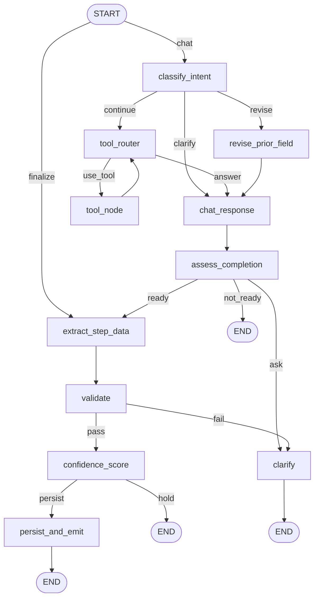

# AI Flow Contracts Implementation Plan

> **For agentic workers:** REQUIRED SUB-SKILL: Use `superpowers:subagent-driven-development`
> (recommended) or `superpowers:executing-plans` to implement this plan task-by-task. Steps use
> checkbox (`- [ ]`) syntax. See [`../spec.md`](../spec.md) for the design and Acceptance criteria.

**Goal:** Make both LangGraph AI flows self-describing (contract table, mermaid diagram, per-node
JSDoc, failure matrix) and make `courseAI` node failures distinguishable as retryable vs. fatal, all
the way to the SSE stream.

**Architecture:** A pure `classifyNodeError` maps a caught error onto `RetryableNodeError` or
`FatalNodeError` by *shape* (`name`, `lc_error_code`, `status`) rather than by message text;
`withNodeErrors` stays a thin wrapper that rethrows what the classifier returns and logs the kind.
The route maps the class onto a `retryable` boolean on the existing `error` SSE event. Documentation
is protected from rot by a source-parsing contract test, mirroring `entryPoints.contract.test.ts`.

**Tech Stack:** TypeScript, LangGraph (`@langchain/langgraph`), `@langchain/openai`, Vitest
(`unit` + `integration` projects), consola logger, Biome.

## Global Constraints

- No retry logic and no tool timeouts — `ai-hardening-plan.md` §5 defers both to workstream D.
- Typed node errors are `courseAI`-only; `learningPathAI` keeps throwing its domain errors directly.
- No provider message, node internal, or stack trace may reach the client.
- Happy-path behavior must not change: routing, the 0.8 auto-advance threshold, `node_start` emission,
  and persisted data all stay as they are. Existing test suites must pass untouched.
- Unit tests are `*.test.ts` (no DB); integration tests are `*.integration.test.ts`.

**Codebase anchors (verified during planning):**

- `DomainError` (`server/services/base/base.errors.ts:5-15`) — `constructor(message, code: TRPCCode = "INTERNAL_SERVER_ERROR", cause?, context?)`; sets `this.name = this.constructor.name`. All service errors extend it.
- `CourseAIError` (`server/services/courseAI/courseAI.errors.ts:3`) — one-line class declaration; that file holds **no logic** by convention (ADR-010), which is why the classifier gets its own module.
- `withNodeErrors` (`server/services/courseAI/graph/withNodeErrors.ts:11-20`) — catches, `logger.error(err)`, throws a fresh `CourseAIError` with no `cause`. 10 wrapped nodes.
- **LangChain rewrites provider errors before a node sees them** (`node_modules/@langchain/openai/dist/utils/client.js`, `wrapOpenAIClientError`): `APIConnectionTimeoutError` → plain `Error` with `name = "TimeoutError"` (**status is lost**); `APIUserAbortError` → `name = "AbortError"`; status 429 → `lc_error_code = "MODEL_RATE_LIMIT"`; 401 → `MODEL_AUTHENTICATION`; 404 → `MODEL_NOT_FOUND`; 400 + `tool_calls` → `INVALID_TOOL_RESULTS`; everything else passes through unchanged. `addLangChainErrorFields` (`@langchain/core/dist/errors/index.js:12-16`) sets `lc_error_code` as a plain property on the same object.
- **`openai` is not a direct dependency** (`package.json:46-49` has only `@langchain/*`; `node_modules/openai` does not exist) — `import { APIError } from "openai"` will not resolve. Classification must duck-type.
- `OutputParserException` (`@langchain/core/output_parsers`) — verified: its `.name` is `"Error"`, so name matching fails; it carries `lc_error_code === "OUTPUT_PARSING_FAILURE"`.
- `isAbortError` (`lib/guards/isAbortError.ts:1-10`) — `error.name === "AbortError"`; already the repo's abort predicate.
- `logger` (`server/utils/logger.ts:3`) — consola; the repo's structured style is object-first, message-second (`guardUserInput.ts:32-42`).
- Route catch (`app/api/chat/course/route.ts:197-202`) — `console.error` + `send({ type: "error", message: "Failed to generate AI response" })`. This is a raw SSE handler: `handleServiceError`/ADR-010 is **not** on this path.
- `StreamEvent` / `isStreamEvent` (`app/_components/Course/components/AIChatBuilderDialog/guards/isStreamEvent.ts:16, 45-46`) — the `error` variant is `{ type: "error"; message: string }`. No existing test touches it.
- `useChatStreaming.ts:63-65` — `if (parsed.type === "error") toast.error(parsed.message)`; drops any event failing `isStreamEvent` (`:50`).
- `entryPoints.contract.test.ts:1-46` — the contract-test pattern to mirror: `walk()` over roots, regex over raw source, `expect(unaccounted).toEqual([])`.
- `graph.ts:56-100` — 11 `.addNode(` calls, 6 named `route*` predicates. `graph.ts:60` is `new ToolNode(allTools)` — no module, no JSDoc site.
- `learningPathAI.graph.ts:14-38` — **7** `.addNode(` calls; `decideStrategy` is a predicate passed to `addConditionalEdges` (`:25`), never registered as a node; `decideStrategy.node.ts` also exports `setSkipLLMIfEmpty`, registered as the node `"setSkipLLM"` (`:18`).
- `chatResponse.autoTransition.test.ts:3-20` — node-test convention: `vi.hoisted` spy, hand-written fake `ChatOpenAI` class replacing the module, node imported via top-level `await import(...)` **after** the mock.
- `route.integration.test.ts:5-38` — route-test convention: `vi.hoisted` mocks for `getSession`, module mock for `@langchain/openai`, `readSse` helper.
- `vitest.config.ts:10-32` — `unit` project takes `**/*.test.ts` excluding `**/*.integration.test.ts`.

**Per-task conventions:** after the implementation step, `pnpm typecheck` and `pnpm check` must be
clean before committing. One commit per task. Run unit tests with
`pnpm vitest run --project unit <path>`; integration with `pnpm vitest run --project integration <path>`.

> **Build stays red across Tasks 5–7 on purpose.** Task 5 commits a contract test that fails until
> Tasks 6–8 supply the JSDoc and the contract document. This is the RED phase of the docs work — the
> alternative (writing docs first, test last) would let the test be shaped to whatever was written.
> Every other task leaves the suite green.

---

## Task 1: `classifyNodeError` — shape-based retryable/fatal classification

**Files:**
- Modify: `server/services/courseAI/courseAI.errors.ts`
- Create: `server/services/courseAI/graph/nodeErrors.ts`
- Test: `server/services/courseAI/graph/nodeErrors.test.ts`

**Interfaces:**
- Produces: `RetryableNodeError` / `FatalNodeError` (both `extends DomainError`, both carry a
  `readonly retryable: boolean` literal) and
  `classifyNodeError(err: unknown, node: string): RetryableNodeError | FatalNodeError` — pure, never
  throws, never logs.

- [ ] **Step 1: Write the failing test**

```ts
// server/services/courseAI/graph/nodeErrors.test.ts
import { describe, expect, it } from "vitest";
import { classifyNodeError } from "./nodeErrors";

/** LangChain hands nodes plain Errors with extra fields — see wrapOpenAIClientError. */
const providerError = (fields: Record<string, unknown>): Error =>
	Object.assign(new Error("upstream boom"), fields);

describe("classifyNodeError", () => {
	it("treats a LangChain-rewritten timeout as retryable", () => {
		const result = classifyNodeError(
			providerError({ name: "TimeoutError" }),
			"chat_response",
		);

		expect(result.retryable).toBe(true);
	});

	it("treats a rate limit as retryable via lc_error_code, not via status", () => {
		// wrapOpenAIClientError only tags the error; status stays on the object but
		// the tag is the stable signal.
		const result = classifyNodeError(
			providerError({ lc_error_code: "MODEL_RATE_LIMIT", status: 429 }),
			"extract_step_data",
		);

		expect(result.retryable).toBe(true);
	});

	it("treats a network fault with no status as retryable", () => {
		const result = classifyNodeError(
			providerError({ name: "APIConnectionError" }),
			"tool_router",
		);

		expect(result.retryable).toBe(true);
	});

	it("treats a 5xx passthrough as retryable", () => {
		const result = classifyNodeError(
			providerError({ status: 503 }),
			"confidence_score",
		);

		expect(result.retryable).toBe(true);
	});

	it("treats a structured-output parse failure as fatal", () => {
		const result = classifyNodeError(
			providerError({ lc_error_code: "OUTPUT_PARSING_FAILURE" }),
			"extract_step_data",
		);

		expect(result.retryable).toBe(false);
	});

	it("treats a bad API key as fatal", () => {
		const result = classifyNodeError(
			providerError({ lc_error_code: "MODEL_AUTHENTICATION", status: 401 }),
			"clarify",
		);

		expect(result.retryable).toBe(false);
	});

	it("treats a programming error as fatal", () => {
		const result = classifyNodeError(
			new TypeError("x is not a function"),
			"validate",
		);

		expect(result.retryable).toBe(false);
	});

	it("fails closed: an unrecognised shape is fatal, not retryable", () => {
		// Telling an instructor to retry a bug trains them to retry it forever.
		const result = classifyNodeError({ weird: true }, "persist_and_emit");

		expect(result.retryable).toBe(false);
	});

	it("names the node and keeps the original error as cause, without copying its message", () => {
		const original = providerError({ name: "TimeoutError" });

		const result = classifyNodeError(original, "chat_response");

		expect(result.message).toBe('[courseAI.graph] node "chat_response" failed');
		expect(result.cause).toBe(original);
	});
});
```

- [ ] **Step 2: Run it, expect FAIL**

Run: `pnpm vitest run --project unit server/services/courseAI/graph/nodeErrors.test.ts`
Expected: FAIL — `Failed to resolve import "./nodeErrors"`.

- [ ] **Step 3: Implement minimally**

```ts
// server/services/courseAI/courseAI.errors.ts
import { DomainError } from "@/server/services/base/base.errors";

export class CourseAIError extends DomainError {}
export class CourseAIToolError extends DomainError {}

/** A node failed for a reason that may not recur: provider timeout, rate limit, network fault. */
export class RetryableNodeError extends DomainError {
	readonly retryable = true;
}

/** A node failed for a reason that recurs until code or configuration changes. */
export class FatalNodeError extends DomainError {
	readonly retryable = false;
}
```

```ts
// server/services/courseAI/graph/nodeErrors.ts
import {
	FatalNodeError,
	RetryableNodeError,
} from "@/server/services/courseAI/courseAI.errors";

/**
 * `@langchain/openai` rewrites provider errors before a node ever sees them
 * (`wrapOpenAIClientError`): a connection timeout arrives as a plain Error named
 * "TimeoutError" with its status stripped, and 401/404/429 arrive tagged with an
 * `lc_error_code`. So classification keys off shape — name, tag, status — never
 * off message text, which providers reword without notice.
 *
 * `openai` is not a direct dependency of this app, so its error classes cannot be
 * imported for `instanceof` checks even if they survived the rewrite.
 */
const RETRYABLE_LC_CODES = new Set(["MODEL_RATE_LIMIT"]);
const RETRYABLE_NAMES = new Set(["TimeoutError", "APIConnectionError"]);

type ErrorShape = {
	name?: string;
	status?: number;
	lcCode?: string;
};

const shapeOf = (err: unknown): ErrorShape => {
	if (typeof err !== "object" || err === null) return {};
	const candidate = err as Record<string, unknown>;
	return {
		name: typeof candidate.name === "string" ? candidate.name : undefined,
		status: typeof candidate.status === "number" ? candidate.status : undefined,
		lcCode:
			typeof candidate.lc_error_code === "string"
				? candidate.lc_error_code
				: undefined,
	};
};

/**
 * Fails closed: anything unrecognised is fatal. An unknown shape is far more
 * likely a bug in this codebase than a transient provider fault, and a bug shown
 * to the instructor as "try again" is a bug they will retry forever.
 */
const isRetryable = (err: unknown): boolean => {
	const { name, status, lcCode } = shapeOf(err);

	if (lcCode) return RETRYABLE_LC_CODES.has(lcCode);
	if (name && RETRYABLE_NAMES.has(name)) return true;
	if (status !== undefined) return status >= 500;

	return false;
};

/**
 * Pure: returns the classified error, never throws it and never logs. Callers own
 * both, so the classification stays unit-testable in isolation.
 */
export const classifyNodeError = (
	err: unknown,
	node: string,
): RetryableNodeError | FatalNodeError => {
	const message = `[courseAI.graph] node "${node}" failed`;

	return isRetryable(err)
		? new RetryableNodeError(message, "SERVICE_UNAVAILABLE", err)
		: new FatalNodeError(message, "INTERNAL_SERVER_ERROR", err);
};
```

- [ ] **Step 4: Run it, expect PASS** — 9 passing; then `pnpm typecheck` + `pnpm check` clean.

- [ ] **Step 5: Commit**

```bash
git add server/services/courseAI/courseAI.errors.ts server/services/courseAI/graph/nodeErrors.ts server/services/courseAI/graph/nodeErrors.test.ts
git commit -m "feat(courseAI): classify node errors as retryable or fatal by error shape"
```

---

## Task 2: Wire `withNodeErrors` to the classifier

**Files:**
- Modify: `server/services/courseAI/graph/withNodeErrors.ts:1-20`
- Test: `server/services/courseAI/graph/withNodeErrors.test.ts`

**Interfaces:**
- Consumes: `classifyNodeError` (Task 1).
- Produces: unchanged `withNodeErrors(name, fn)` signature — every wrapped node now throws
  `RetryableNodeError` / `FatalNodeError` instead of `CourseAIError`, and aborts pass through raw.

- [ ] **Step 1: Write the failing test**

```ts
// server/services/courseAI/graph/withNodeErrors.test.ts
import { describe, expect, it, vi } from "vitest";
import {
	FatalNodeError,
	RetryableNodeError,
} from "@/server/services/courseAI/courseAI.errors";
import { withNodeErrors } from "./withNodeErrors";

const { mockLogger } = vi.hoisted(() => ({
	mockLogger: { error: vi.fn() },
}));

vi.mock("@/server/utils/logger", () => ({ logger: mockLogger }));

const state = {} as never;

describe("withNodeErrors", () => {
	it("passes a successful node result through untouched", async () => {
		const node = withNodeErrors("validate", async () => ({
			validationErrors: null,
		}));

		await expect(node(state)).resolves.toEqual({ validationErrors: null });
	});

	it("rethrows a provider timeout as RetryableNodeError", async () => {
		const node = withNodeErrors("chat_response", async () => {
			throw Object.assign(new Error("upstream boom"), { name: "TimeoutError" });
		});

		await expect(node(state)).rejects.toBeInstanceOf(RetryableNodeError);
	});

	it("rethrows a programming error as FatalNodeError", async () => {
		const node = withNodeErrors("validate", async () => {
			throw new TypeError("x is not a function");
		});

		await expect(node(state)).rejects.toBeInstanceOf(FatalNodeError);
	});

	it("rethrows a client abort untouched and does not log it", async () => {
		// An instructor navigating away is not a failure — counting it would
		// poison the failure-rate signal workstream D is built on.
		mockLogger.error.mockClear();
		const abort = Object.assign(new Error("aborted"), { name: "AbortError" });
		const node = withNodeErrors("clarify", async () => {
			throw abort;
		});

		await expect(node(state)).rejects.toBe(abort);
		expect(mockLogger.error).not.toHaveBeenCalled();
	});

	it("logs the node name and the error kind structurally", async () => {
		mockLogger.error.mockClear();
		const node = withNodeErrors("extract_step_data", async () => {
			throw Object.assign(new Error("rate limited"), {
				lc_error_code: "MODEL_RATE_LIMIT",
			});
		});

		await expect(node(state)).rejects.toBeInstanceOf(RetryableNodeError);
		const [fields] = mockLogger.error.mock.calls[0] ?? [];
		expect(fields).toMatchObject({
			feature: "courseAI",
			node: "extract_step_data",
			kind: "retryable",
		});
	});
});
```

- [ ] **Step 2: Run it, expect FAIL**

Run: `pnpm vitest run --project unit server/services/courseAI/graph/withNodeErrors.test.ts`
Expected: FAIL — the two `rejects.toBeInstanceOf` cases get `CourseAIError`; the abort case fails
because the abort is wrapped; the log case fails because the current call is `logger.error(err)` with
no fields object.

- [ ] **Step 3: Implement minimally**

```ts
// server/services/courseAI/graph/withNodeErrors.ts
import type { RunnableConfig } from "@langchain/core/runnables";
import { isAbortError } from "@/lib/guards/isAbortError";
import { logger } from "@/server/utils/logger";
import { classifyNodeError } from "./nodeErrors";
import type { CourseBuilderStateT } from "./state";

type NodeFn = (
	state: CourseBuilderStateT,
	config?: RunnableConfig,
) => Promise<Partial<CourseBuilderStateT>>;

export const withNodeErrors = (name: string, fn: NodeFn): NodeFn => {
	return async (state, config) => {
		try {
			return await fn(state, config);
		} catch (err) {
			// An aborted request is not a failure: rethrow it untouched so it never
			// enters the failure signal (workstream D counts what is logged here).
			if (isAbortError(err)) throw err;

			const classified = classifyNodeError(err, name);
			logger.error(
				{
					feature: "courseAI",
					node: name,
					kind: classified.retryable ? "retryable" : "fatal",
					err,
				},
				"[courseAI.graph] node failed",
			);
			throw classified;
		}
	};
};
```

- [ ] **Step 4: Run it, expect PASS** — 5 passing. Then run the existing graph suites to prove nothing
regressed: `pnpm vitest run --project unit server/services/courseAI` (expect all green), plus
`pnpm typecheck` + `pnpm check`.

- [ ] **Step 5: Commit**

```bash
git add server/services/courseAI/graph/withNodeErrors.ts server/services/courseAI/graph/withNodeErrors.test.ts
git commit -m "feat(courseAI): throw typed node errors and log the failure kind"
```

---

## Task 3: Carry `retryable` on the SSE `error` event type

**Files:**
- Modify: `app/_components/Course/components/AIChatBuilderDialog/guards/isStreamEvent.ts:16, 45-46`
- Test: `app/_components/Course/components/AIChatBuilderDialog/guards/isStreamEvent.test.ts`

**Interfaces:**
- Produces: `StreamEvent`'s error variant becomes `{ type: "error"; message: string; retryable: boolean }`.
  Task 4's route is the only producer of that event.

- [ ] **Step 1: Write the failing test**

```ts
// app/_components/Course/components/AIChatBuilderDialog/guards/isStreamEvent.test.ts
import { describe, expect, it } from "vitest";
import { isStreamEvent } from "./isStreamEvent";

describe("isStreamEvent — error variant", () => {
	it("accepts an error event carrying the retryable flag", () => {
		expect(
			isStreamEvent({ type: "error", message: "boom", retryable: true }),
		).toBe(true);
	});

	it("rejects an error event without the retryable flag", () => {
		// The flag is required so a stale server can never render as a
		// permanent failure the client would silently mislabel.
		expect(isStreamEvent({ type: "error", message: "boom" })).toBe(false);
	});

	it("still accepts the events it accepted before", () => {
		expect(isStreamEvent({ type: "done" })).toBe(true);
		expect(isStreamEvent({ type: "token", value: "hi" })).toBe(true);
		expect(isStreamEvent({ type: "guard_blocked", message: "no" })).toBe(true);
	});
});
```

- [ ] **Step 2: Run it, expect FAIL**

Run: `pnpm vitest run --project unit app/_components/Course/components/AIChatBuilderDialog/guards/isStreamEvent.test.ts`
Expected: FAIL — "rejects an error event without the retryable flag" returns `true`, because the
current guard only checks `message`.

- [ ] **Step 3: Implement minimally**

In `isStreamEvent.ts`, change the union member on line 16:

```ts
	| { type: "error"; message: string; retryable: boolean }
```

and the guard case on lines 45-46:

```ts
		case "error":
			return (
				typeof event.message === "string" &&
				typeof event.retryable === "boolean"
			);
```

- [ ] **Step 4: Run it, expect PASS** — 3 passing; `pnpm typecheck` + `pnpm check` clean.
`useChatStreaming.ts:63-65` needs no change: `parsed.type === "error"` still narrows, and it already
reads only `parsed.message`.

- [ ] **Step 5: Commit**

```bash
git add app/_components/Course/components/AIChatBuilderDialog/guards/isStreamEvent.ts app/_components/Course/components/AIChatBuilderDialog/guards/isStreamEvent.test.ts
git commit -m "feat(courseAI): carry a retryable flag on the error stream event"
```

---

## Task 4: Map the error kind onto the SSE stream in the route

**Files:**
- Modify: `app/api/chat/course/route.ts:197-202`
- Test: `app/api/chat/course/route.nodeErrors.integration.test.ts`

**Interfaces:**
- Consumes: `RetryableNodeError` (Task 1), the widened `error` event (Task 3).
- Produces: `{ type: "error", retryable: boolean, message: string }` on the wire, with two fixed copy
  strings and nothing derived from the caught error.

- [ ] **Step 1: Write the failing test**

```ts
// app/api/chat/course/route.nodeErrors.integration.test.ts
import { beforeEach, describe, expect, it, vi } from "vitest";
import { makeUser } from "@/test/factories";

const { mockGetSession, mockCheckTopicRelevance, mockRunChat, mockGetOrCreate } =
	vi.hoisted(() => ({
		mockGetSession: vi.fn(),
		mockCheckTopicRelevance: vi.fn(),
		mockRunChat: vi.fn(),
		mockGetOrCreate: vi.fn(),
	}));

vi.mock("@/server/better-auth/server", () => ({ getSession: mockGetSession }));
vi.mock("@/server/services/_shared/aiGuard/topicRelevance", () => ({
	checkTopicRelevance: mockCheckTopicRelevance,
}));
vi.mock("@/server/services/courseAI/courseAI.service", () => ({
	courseAIService: {
		getOrCreateCourseGeneration: mockGetOrCreate,
		runChat: mockRunChat,
		runFinalize: vi.fn(),
		saveMessage: vi.fn().mockResolvedValue(undefined),
	},
}));

const { POST } = await import("./route");
const { RetryableNodeError, FatalNodeError } = await import(
	"@/server/services/courseAI/courseAI.errors"
);

const readSse = async (res: Response): Promise<string> =>
	res.body ? await new Response(res.body).text() : "";

const post = () =>
	POST(
		new Request("http://localhost/api/chat/course", {
			method: "POST",
			body: JSON.stringify({
				userMessage: "Let's call the course Intro to Python.",
				mode: "chat",
			}),
		}),
	);

describe("POST /api/chat/course — node failures", () => {
	beforeEach(async () => {
		vi.clearAllMocks();
		const instructor = await makeUser({ role: "INSTRUCTOR" });
		mockGetSession.mockResolvedValue({
			user: { id: instructor.id, role: "INSTRUCTOR" },
		});
		mockCheckTopicRelevance.mockResolvedValue({
			onTopic: true,
			reason: "course design",
		});
		mockGetOrCreate.mockResolvedValue({ id: "gen-1", step: "BASIC" });
	});

	const throwFrom = (error: Error) => {
		mockRunChat.mockImplementation(async () =>
			(async function* () {
				throw error;
				// biome-ignore lint/correctness/noUnreachable: generator needs a yield to type as one
				yield {} as never;
			})(),
		);
	};

	it("reports a retryable node failure as retryable, with try-again copy", async () => {
		throwFrom(
			new RetryableNodeError(
				'[courseAI.graph] node "chat_response" failed',
				"SERVICE_UNAVAILABLE",
				new Error("upstream boom"),
			),
		);

		const body = await readSse(await post());

		expect(body).toContain('"type":"error"');
		expect(body).toContain('"retryable":true');
		expect(body).toContain("try again");
	});

	it("reports a fatal node failure as non-retryable", async () => {
		throwFrom(
			new FatalNodeError(
				'[courseAI.graph] node "validate" failed',
				"INTERNAL_SERVER_ERROR",
				new TypeError("x is not a function"),
			),
		);

		const body = await readSse(await post());

		expect(body).toContain('"retryable":false');
		expect(body).toContain("Failed to generate AI response");
	});

	it("leaks no node name, provider message, or stack to the client", async () => {
		throwFrom(
			new RetryableNodeError(
				'[courseAI.graph] node "chat_response" failed',
				"SERVICE_UNAVAILABLE",
				new Error("upstream boom"),
			),
		);

		const body = await readSse(await post());

		expect(body).not.toContain("chat_response");
		expect(body).not.toContain("upstream boom");
		expect(body).not.toContain("courseAI.graph");
	});
});
```

- [ ] **Step 2: Run it, expect FAIL**

Run: `pnpm vitest run --project integration app/api/chat/course/route.nodeErrors.integration.test.ts`
Expected: FAIL — the emitted event is `{"type":"error","message":"Failed to generate AI response"}`
with no `retryable` field, so the first two tests fail on the missing flag.

- [ ] **Step 3: Implement minimally**

In `app/api/chat/course/route.ts`, add the imports:

```ts
import { RetryableNodeError } from "@/server/services/courseAI/courseAI.errors";
import { logger } from "@/server/utils/logger";
```

and replace the catch block (lines 197-202):

```ts
			} catch (e) {
				if (!abortSignal.aborted) {
					// Anything not thrown through withNodeErrors — notably a tool-argument
					// rejection from the unwrapped tool_node — is unclassified and so reads
					// as non-retryable. That is deliberate: an unknown shape is more likely
					// a bug than a transient fault.
					const retryable = e instanceof RetryableNodeError;
					logger.error(
						{ feature: "courseAI", retryable, err: e },
						"[courseAI] stream failed",
					);
					send({
						type: "error",
						retryable,
						message: retryable
							? "The AI service is briefly unavailable — please try again."
							: "Failed to generate AI response",
					});
				}
			} finally {
```

- [ ] **Step 4: Run it, expect PASS** — 3 passing. Then re-run the pre-existing route suite to prove
it is untouched: `pnpm vitest run --project integration app/api/chat/course/route.integration.test.ts`
(2 passing). `pnpm typecheck` + `pnpm check` clean.

- [ ] **Step 5: Commit**

```bash
git add app/api/chat/course/route.ts app/api/chat/course/route.nodeErrors.integration.test.ts
git commit -m "feat(courseAI): distinguish retryable and fatal failures on the chat stream"
```

---

## Task 5: The contract test (intentionally RED until Task 8)

**Files:**
- Create: `server/services/courseAI/graph/graphContract.contract.test.ts`

**Interfaces:**
- Consumes: nothing from earlier tasks — it reads sources and `graph-contract.md` off disk.
- Produces: the CI gate that makes Tasks 6-8 verifiable. It parses `graph.ts` and
  `learningPathAI.graph.ts` as ground truth; there is deliberately **no** hand-written node registry,
  because a second copy of the node list is exactly the drift this feature exists to prevent.

- [ ] **Step 1: Write the test**

```ts
// server/services/courseAI/graph/graphContract.contract.test.ts
import { readFileSync } from "node:fs";
import { describe, expect, it } from "vitest";

const CONTRACT_DOC = "docs/specs/features/ai-flow-contracts/graph-contract.md";
const COURSE_GRAPH = "server/services/courseAI/graph/graph.ts";
const PATH_GRAPH = "server/services/learningPathAI/learningPathAI.graph.ts";

/** ToolNode is a LangGraph prebuilt: a row in the table, but no module to document. */
const EXEMPT_FROM_JSDOC = ["tool_node"];

const read = (path: string): string => readFileSync(path, "utf-8");

const registeredNodes = (source: string): string[] =>
	[...source.matchAll(/\.addNode\("([^"]+)"/g)].map((m) => m[1] as string);

const namedPredicates = (source: string): string[] => [
	...new Set(
		[...source.matchAll(/\.addConditionalEdges\([^,]+,\s*(\w+)/g)].map(
			(m) => m[1] as string,
		),
	),
];

/** node name -> the module that implements it, resolved from the graph's imports. */
const moduleFor = (source: string, symbol: string): string | undefined => {
	const importLine = new RegExp(
		`import\\s*\\{[^}]*\\b${symbol}\\b[^}]*\\}\\s*from\\s*"([^"]+)"`,
	).exec(source);
	return importLine?.[1];
};

const symbolForNode = (source: string, node: string): string | undefined =>
	new RegExp(`\\.addNode\\("${node}",\\s*(\\w+)`).exec(source)?.[1];

const jsDocFor = (file: string, symbol: string): string | undefined => {
	const source = read(file);
	const match = new RegExp(
		`/\\*\\*([\\s\\S]*?)\\*/\\s*export\\s+(?:const|async function|function)\\s+${symbol}\\b`,
	).exec(source);
	return match?.[1];
};

const REQUIRED_LABELS = ["Purpose:", "Reads:", "Writes:", "Fails:"];

describe("AI graph contract (ai-flow-contracts)", () => {
	const courseSource = read(COURSE_GRAPH);
	const pathSource = read(PATH_GRAPH);
	const doc = read(CONTRACT_DOC);

	it("documents every registered node and named route predicate", () => {
		const documented = [
			...registeredNodes(courseSource),
			...namedPredicates(courseSource),
			...registeredNodes(pathSource),
			...namedPredicates(pathSource),
		];

		const missing = documented.filter((name) => !doc.includes(name));

		expect(missing).toEqual([]);
	});

	it("gives every node module a four-label JSDoc block", () => {
		const targets = [
			{ graph: COURSE_GRAPH, source: courseSource },
			{ graph: PATH_GRAPH, source: pathSource },
		].flatMap(({ graph, source }) => {
			const dir = graph.slice(0, graph.lastIndexOf("/"));
			return [
				...registeredNodes(source)
					.filter((node) => !EXEMPT_FROM_JSDOC.includes(node))
					.map((node) => symbolForNode(source, node)),
				...namedPredicates(source),
			]
				.filter((symbol): symbol is string => Boolean(symbol))
				.map((symbol) => {
					const spec = moduleFor(source, symbol);
					// No import for this symbol means it is declared in the graph file
					// itself — that is where every courseAI route predicate lives.
					const file = spec
						? `${dir}/${spec.replace(/^\.\//, "")}.ts`
						: graph;
					return { symbol, file };
				});
		});

		const undocumented = targets.filter(({ symbol, file }) => {
			const block = jsDocFor(file, symbol);
			return !block || !REQUIRED_LABELS.every((label) => block.includes(label));
		});

		expect(undocumented.map((t) => t.symbol)).toEqual([]);
	});
});
```

- [ ] **Step 2: Run it, expect FAIL — and read the failure as the work list**

Run: `pnpm vitest run --project unit server/services/courseAI/graph/graphContract.contract.test.ts`
Expected: FAIL on both tests — the first with `ENOENT` for `graph-contract.md` (Task 8 creates it),
the second listing all 24 undocumented symbols (11 courseAI nodes minus the exempt `tool_node`, plus
6 courseAI predicates, 7 learningPathAI nodes and `decideStrategy`). Copy that list; Tasks 6-7 clear
it. The inline arrow predicate on `reflectAndCheck`'s loop is not matched by the predicate regex and
so is not required to be documented — intentional, per `spec.md`.

`learningPathAI` resolves its nodes through the barrel `./nodes`, so `moduleFor` returns `"./nodes"`
and `file` becomes `server/services/learningPathAI/nodes.ts`, which does not exist — every
learningPathAI symbol is reported as undocumented. Task 7 fixes this by pointing the resolution at
`nodes/index.ts` re-exports; if the executor prefers, add to `jsDocFor` a fallback that, when the
resolved file is a barrel, searches every `*.node.ts` in that directory for the symbol. Implement the
fallback now, in this step, rather than leaving it to Task 7:

```ts
import { readdirSync } from "node:fs";

const candidateFiles = (file: string): string[] => {
	if (!file.endsWith("/nodes.ts")) return [file];
	const dir = file.replace(/\.ts$/, "");
	return readdirSync(dir)
		.filter((entry) => entry.endsWith(".ts") && !entry.startsWith("index"))
		.map((entry) => `${dir}/${entry}`);
};
```

and in the second test replace `const block = jsDocFor(file, symbol);` with:

```ts
			const block = candidateFiles(file)
				.map((candidate) => jsDocFor(candidate, symbol))
				.find(Boolean);
```

- [ ] **Step 3: Commit the red test**

```bash
git add server/services/courseAI/graph/graphContract.contract.test.ts
git commit -m "test(ai-flow): fail CI on an undocumented graph node or route predicate"
```

> This commit leaves `pnpm test:unit` red. Tasks 6-8 turn it green; do not proceed to `/qa` before
> Task 8 passes.

---

## Task 6: JSDoc every `courseAI` node

**Files:**
- Modify: all 10 modules in `server/services/courseAI/graph/nodes/` and the 6 predicates in
  `server/services/courseAI/graph/graph.ts:29-52`

- [ ] **Step 1: Add the block above each node export.** Insert verbatim:

`classifyIntent.ts` (above `export const classifyIntent`):
```ts
/**
 * Purpose: classifies the current turn as continue / revise / clarify and names the step to revise.
 * Reads: history, userMessage, currentStep.
 * Writes: intent, reviseTarget.
 * Fails: never propagates — a model error is caught locally and falls back to intent "continue",
 * so a provider outage silently degrades routing instead of surfacing.
 */
```

`revisePriorField.ts`:
```ts
/**
 * Purpose: re-extracts a previously completed step from the revision request and persists the merge.
 * Reads: reviseTarget, content, history filtered to reviseTarget, userMessage, generationId.
 * Writes: content, assistantText.
 * Fails: propagates — both the model call and courseGenerationRepository.update are unguarded.
 */
```

`toolRouter.ts`:
```ts
/**
 * Purpose: asks a tool-bound model whether a tool call is needed before answering.
 * Reads: currentStep, content, history, userMessage, messages.
 * Writes: toolCalls (accumulating reducer), pendingToolCalls (overwritten every pass), messages.
 * Fails: propagates — model.invoke is unguarded.
 */
```

`chatResponse.ts`:
```ts
/**
 * Purpose: streams the assistant reply, choosing between the auto-transition, revise-confirm,
 * clarify and normal prompt branches.
 * Reads: userMessage, currentStep, content, intent, history.
 * Writes: assistantText (append reducer).
 * Fails: propagates — model.stream is unguarded; a mid-stream drop loses the partial reply.
 */
```

`assessCompletion.ts`:
```ts
/**
 * Purpose: decides whether the current step is ready, not ready, or needs a clarifying question.
 * Reads: userMessage, intent, history filtered to currentStep, currentStep, assistantText.
 * Writes: assessReady, assessClarify.
 * Fails: never propagates — a model error is caught locally and falls back to assessReady false,
 * which reads to the instructor as "the step isn't complete yet".
 */
```

`extractStepData.ts`:
```ts
/**
 * Purpose: extracts structured step data with a relaxed schema — min/max live in validate.ts so
 * schema constraints do not leak into the model's output.
 * Reads: currentStep, history filtered to currentStep, assistantText, userMessage, content.
 * Writes: draftStepData.
 * Fails: propagates — a rate limit or a structured-output parse failure reaches withNodeErrors.
 */
```

`validate.ts`:
```ts
/**
 * Purpose: full Zod validation of draftStepData against the step's real constraints.
 * Reads: currentStep, draftStepData.
 * Writes: validationErrors — null on success, the Zod issues on failure.
 * Fails: does not throw on invalid data; routeAfterValidate sends "fail" to clarify, so a failed
 * validation is a conversation turn, not an error.
 */
```

`confidenceScore.ts`:
```ts
/**
 * Purpose: scores step completeness 0..1 and sets shouldAutoAdvance against the 0.8 threshold.
 * Reads: draftStepData, history filtered to currentStep (ADR-016 — unfiltered history suppresses
 * the score below the threshold), userMessage, assistantText, currentStep, validationErrors.
 * Writes: confidence, shouldAutoAdvance.
 * Fails: propagates — unlike classify_intent and assess_completion, this node has no local fallback.
 */
```

`clarify.ts`:
```ts
/**
 * Purpose: streams one clarifying question — either the ambiguous-intent question from
 * assess_completion or a follow-up on a validation failure.
 * Reads: validationErrors, assessClarify, currentStep, draftStepData, last 4 history entries,
 * userMessage.
 * Writes: assistantText.
 * Fails: propagates — model.stream is unguarded.
 */
```

`persistAndEmit.ts`:
```ts
/**
 * Purpose: commits draftStepData and the step-transition message in a single transaction.
 * Reads: draftStepData, generationId, currentStep.
 * Writes: nothing to state — the effect is the database write.
 * Fails: propagates — a database error aborts the transaction, so no partial step is persisted.
 */
```

- [ ] **Step 2: Add the block above each route predicate in `graph.ts`.** Note these are `const`
declarations, not exports; give them the same four labels so the contract test's regex — which
requires `export` — keeps working by exporting each predicate. Change each `const routeX = ...` to
`export const routeX = ...` and prepend:

```ts
/**
 * Purpose: entry fork — a finalize request skips the conversation and extracts directly.
 * Reads: mode.
 * Writes: nothing — predicates never write state.
 * Fails: cannot fail; a mode other than "finalize" falls through to "chat".
 */
export const routeByMode = (s: CourseBuilderStateT) =>
	s.mode === "finalize" ? "finalize" : "chat";

/**
 * Purpose: routes a classified turn to revision, clarification, or the tool loop.
 * Reads: intent.
 * Writes: nothing.
 * Fails: cannot fail; a null intent falls through to "continue".
 */

/**
 * Purpose: decides whether another tool call is pending or the model can answer.
 * Reads: pendingToolCalls — deliberately not toolCalls, which accumulates across passes and would
 * loop forever.
 * Writes: nothing.
 * Fails: cannot fail.
 */

/**
 * Purpose: routes on step readiness — extract, ask a clarifying question, or end the turn.
 * Reads: assessReady, assessClarify.
 * Writes: nothing.
 * Fails: cannot fail.
 */

/**
 * Purpose: routes on validation outcome.
 * Reads: validationErrors.
 * Writes: nothing.
 * Fails: cannot fail. "fail" targets clarify, not END — the instructor is asked for the missing
 * detail and nothing is persisted.
 */

/**
 * Purpose: decides whether the step commits now or waits for the instructor's Accept.
 * Reads: mode, shouldAutoAdvance.
 * Writes: nothing.
 * Fails: cannot fail.
 */
```

- [ ] **Step 3: Verify the JSDoc half of the contract test** —
`pnpm vitest run --project unit server/services/courseAI/graph/graphContract.contract.test.ts`
Expected: the second test now lists only the 8 learningPathAI symbols; the first still fails on the
missing document. `pnpm typecheck` + `pnpm check` clean.

- [ ] **Step 4: Commit**

```bash
git add server/services/courseAI/graph
git commit -m "docs(courseAI): document every graph node and route predicate inline"
```

---

## Task 7: JSDoc every `learningPathAI` node

**Files:**
- Modify: the 7 modules in `server/services/learningPathAI/nodes/` — note `decideStrategy.node.ts`
  needs **two** blocks, one per exported symbol.

- [ ] **Step 1: Add the blocks.** Insert verbatim above each export:

`loadStudentSignal.node.ts`:
```ts
/**
 * Purpose: loads the student's enrollment, lesson order, quiz attempts and mastery for the course.
 * Reads: studentId, courseId.
 * Writes: completedLessonIds, lessonOrder, quizAttempts, mastery.
 * Fails: throws CourseUnavailableError ("BAD_REQUEST") when the student is not enrolled or the
 * course is deleted or unpublished — the graph stops here and tRPC maps it to a 400.
 */
```

`identifyWeakSignals.node.ts`:
```ts
/**
 * Purpose: derives the weak concepts (mastery below 3) and the deduplicated failed quizzes.
 * Reads: completedLessonIds, mastery, lessonOrder, quizAttempts.
 * Writes: weakConcepts, failedQuizzes.
 * Fails: cannot fail — pure computation over already-loaded signal.
 */
```

`decideStrategy.node.ts`, above `decideStrategy`:
```ts
/**
 * Purpose: picks the proposal strategy — review weak areas, propose new lessons, or skip the model
 * entirely for a student with no history. This is a route predicate, never registered via addNode.
 * Reads: completedLessonIds, quizAttempts, weakConcepts, failedQuizzes.
 * Writes: nothing.
 * Fails: cannot fail.
 */
```

`decideStrategy.node.ts`, above `setSkipLLMIfEmpty` (registered as the node `setSkipLLM`):
```ts
/**
 * Purpose: marks a no-history student so mergeAndExplain builds the path deterministically instead
 * of paying for a model call that has nothing to reason about.
 * Reads: completedLessonIds, quizAttempts.
 * Writes: skipLLM.
 * Fails: cannot fail.
 */
```

`proposeReviews.node.ts`:
```ts
/**
 * Purpose: proposes up to 3 REVIEW_LESSON and 2 RETRY_QUIZ candidate steps from the weak signal.
 * Reads: weakConcepts (first 3), failedQuizzes (first 2).
 * Writes: candidateSteps.
 * Fails: cannot fail.
 */
```

`proposeNewLessons.node.ts`:
```ts
/**
 * Purpose: appends up to 3 next-in-sequence NEW_LESSON candidates the student has not completed.
 * Reads: completedLessonIds, candidateSteps, lessonOrder.
 * Writes: candidateSteps (appended, not replaced).
 * Fails: cannot fail.
 */
```

`mergeAndExplain.node.ts`:
```ts
/**
 * Purpose: turns candidate steps into the final path plus a summary — deterministically when
 * skipLLM is set, otherwise via a structured model call re-validated up to 3 times.
 * Reads: skipLLM, candidateSteps, weakConcepts, lessonOrder, completedLessonIds, failedQuizzes,
 * reflectionFeedback, studentId (for enrichment lookups).
 * Writes: finalSteps, generatedWeakConcepts, summary.
 * Fails: throws LearningPathInvalidError after 3 failed semantic validations; database lookups
 * during enrichment propagate unguarded.
 */
```

`reflectAndCheck.node.ts`:
```ts
/**
 * Purpose: critiques the proposed path and, on rejection, loops back to mergeAndExplain with
 * feedback — capped at 2 attempts.
 * Reads: reflectionAttempt, finalSteps, weakConcepts, completedLessonIds.
 * Writes: reflectionFeedback, reflectionAttempt.
 * Fails: propagates a model error unguarded — learningPathAI has no withNodeErrors equivalent, so
 * it surfaces through handleServiceError as a 500.
 */
```

- [ ] **Step 2: Verify** —
`pnpm vitest run --project unit server/services/courseAI/graph/graphContract.contract.test.ts`
Expected: the JSDoc test now passes; the document test still fails on the missing file.
`pnpm typecheck` + `pnpm check` clean.

- [ ] **Step 3: Commit**

```bash
git add server/services/learningPathAI/nodes
git commit -m "docs(learningPathAI): document every graph node inline"
```

---

## Task 8: `graph-contract.md` — the contract document

**Files:**
- Create: `docs/specs/features/ai-flow-contracts/graph-contract.md`

- [ ] **Step 1: Write the document.** It has five sections in this order. The per-node rows are the
JSDoc from Tasks 6-7 transposed into table cells — same facts, no new claims — plus the two columns
JSDoc has no place for: outgoing edges and whether the node calls a model.

Header and courseAI node table (first three rows shown complete; the remaining eight follow the same
column layout, sourced from each node's JSDoc):

````markdown
# AI graph contracts

The node-by-node contract for the two LangGraph flows. `graphContract.contract.test.ts` fails CI if a
node or named route predicate registered in either graph is missing here, so this file cannot silently
fall behind the code. See [`spec.md`](spec.md) for scope and
[ADR-016](../../../adr/016-langgraph-course-builder.md) for the decision-level view.

## courseAI — nodes

| Node | Purpose | Reads | Writes | Out | Model | Failure |
|---|---|---|---|---|---|---|
| `classify_intent` | classifies the turn as continue / revise / clarify | `history`, `userMessage`, `currentStep` | `intent`, `reviseTarget` | `routeByIntent` | gpt-4o-mini, structured | swallowed locally → falls back to `continue` |
| `revise_prior_field` | re-extracts and persists a completed step | `reviseTarget`, `content`, `history`, `userMessage`, `generationId` | `content`, `assistantText` | `chat_response` | gpt-4o-mini, structured | propagates (model + DB update) |
| `tool_router` | decides whether a tool call is needed | `currentStep`, `content`, `history`, `userMessage`, `messages` | `toolCalls`, `pendingToolCalls`, `messages` | `routeAfterToolRouter` | gpt-4o-mini, tool-bound | propagates |
| `tool_node` | LangGraph prebuilt `ToolNode`; runs the four course tools | `messages` (last AIMessage), `config.configurable.instructorId` | `messages` (tool results) | `tool_router` | only inside `validateCurriculumCoherence` | tools catch internally and return `{ error }` as output; a hung call has no timeout |

## courseAI — route predicates

| Predicate | Branches on | Labels → target |
|---|---|---|
| `routeByMode` | `mode` | `finalize` → `extract_step_data`; `chat` → `classify_intent` |
| `routeByIntent` | `intent` | `revise` → `revise_prior_field`; `clarify` → `chat_response`; `continue` → `tool_router` |
| `routeAfterToolRouter` | `pendingToolCalls.length` | `use_tool` → `tool_node`; `answer` → `chat_response` |
| `routeAfterAssess` | `assessReady`, `assessClarify` | `ready` → `extract_step_data`; `ask` → `clarify`; `not_ready` → END |
| `routeAfterValidate` | `validationErrors` | `pass` → `confidence_score`; `fail` → `clarify` |
| `routeAfterConfidence` | `mode`, `shouldAutoAdvance` | `persist` → `persist_and_emit`; `hold` → END |

`routeAfterToolRouter` reads `pendingToolCalls`, which `tool_router` overwrites every pass — reading
the accumulating `toolCalls` instead loops forever.

## courseAI — flow



## Failure matrix

| Scenario | System behavior | What the instructor sees | Persisted |
|---|---|---|---|
| Confidence `< 0.8` | `routeAfterConfidence` returns `hold`; the graph ends without `persist_and_emit` | the reply, a confidence badge, and an explicit Accept button | nothing until Accept |
| Validation failure | `validate` writes `validationErrors`; `routeAfterValidate` sends `fail` to `clarify` | a clarifying question naming what is missing — not an error | nothing |
| Tool call never returns | no timeout exists anywhere on this path; the SSE stream stays open until the client aborts | an indefinite in-progress indicator | nothing (the abort path skips the assistant save) |
| Invalid structured output | `withStructuredOutput` throws `OUTPUT_PARSING_FAILURE`; `withNodeErrors` classifies it `FatalNodeError` | "Failed to generate AI response" | the user message only, saved in the route's `finally` |
| Guard block | the route returns before the graph is entered — see [`../ai-input-trust-boundary/spec.md`](../ai-input-trust-boundary/spec.md) | a neutral refusal | nothing |

A retryable failure (provider timeout, rate limit, 5xx) is the sixth case and behaves as the fourth
except that the instructor is told to try again and `retryable: true` rides on the `error` event.

## learningPathAI

| Node | Purpose | Reads | Writes | Failure |
|---|---|---|---|---|
| `loadStudentSignal` | loads enrollment, lesson order, attempts, mastery | `studentId`, `courseId` | `completedLessonIds`, `lessonOrder`, `quizAttempts`, `mastery` | `CourseUnavailableError` (400) |
| `identifyWeakSignals` | derives weak concepts and failed quizzes | `completedLessonIds`, `mastery`, `lessonOrder`, `quizAttempts` | `weakConcepts`, `failedQuizzes` | cannot fail |
| `decideStrategy` | route predicate: `hasWeak` / `ready` / `empty` | `completedLessonIds`, `quizAttempts`, `weakConcepts`, `failedQuizzes` | — | cannot fail |
| `setSkipLLM` | marks a no-history student for the deterministic path | `completedLessonIds`, `quizAttempts` | `skipLLM` | cannot fail |
| `proposeReviews` | up to 3 reviews + 2 quiz retries | `weakConcepts`, `failedQuizzes` | `candidateSteps` | cannot fail |
| `proposeNewLessons` | up to 3 next-in-sequence lessons | `completedLessonIds`, `candidateSteps`, `lessonOrder` | `candidateSteps` | cannot fail |
| `mergeAndExplain` | final path + summary, model or deterministic | `skipLLM`, `candidateSteps`, `weakConcepts`, `lessonOrder`, `reflectionFeedback` | `finalSteps`, `generatedWeakConcepts`, `summary` | `LearningPathInvalidError` after 3 failed semantic validations |
| `reflectAndCheck` | critic; loops back with feedback, capped at 2 | `reflectionAttempt`, `finalSteps`, `weakConcepts`, `completedLessonIds` | `reflectionFeedback`, `reflectionAttempt` | model error propagates unguarded |

`learningPathAI` has no `withNodeErrors`: its nodes throw domain errors that reach tRPC through
`handleServiceError`, so retryable/fatal typing does not apply to this graph.
````

- [ ] **Step 2: Run the contract test, expect PASS**

Run: `pnpm vitest run --project unit server/services/courseAI/graph/graphContract.contract.test.ts`
Expected: PASS — both tests. If the first still fails, the failure lists exactly which node or
predicate name is absent from the document; add that row rather than relaxing the test.

- [ ] **Step 3: Full unit suite green again**

Run: `pnpm test:unit`
Expected: PASS — the red introduced in Task 5 is now cleared.

- [ ] **Step 4: Commit**

```bash
git add docs/specs/features/ai-flow-contracts/graph-contract.md
git commit -m "docs(ai-flow): add the node contract, flow diagram and failure matrix"
```

---

## Task 9: Link the contract from the features that own the graphs

**Files:**
- Modify: `docs/specs/features/ai-course-builder/spec.md` (Agent notes)
- Modify: `docs/specs/features/ai-flow-contracts/spec.md` (frontmatter `status`)

- [ ] **Step 1: Add a pointer to `ai-course-builder/spec.md`'s Agent notes**

```markdown
- The node-by-node state contract, the flow diagram and the failure matrix live in
  [`../ai-flow-contracts/graph-contract.md`](../ai-flow-contracts/graph-contract.md); a contract test
  fails CI if a node is added without a row there.
```

- [ ] **Step 2: Flip `ai-flow-contracts/spec.md` frontmatter** to `status: in-progress` — `/qa` flips
it to `stable` at Gate Docs, together with `pnpm spec:sync`.

- [ ] **Step 3: Regenerate the index**

Run: `pnpm spec:sync`
Expected: `docs/specs/features/_index.md` gains an `ai-flow-contracts` row.

- [ ] **Step 4: Commit**

```bash
git add docs/specs/features
git commit -m "docs(ai-flow): link the graph contract from ai-course-builder and index the feature"
```

---

## Self-review (run before handoff)

**Spec coverage — every acceptance criterion maps to a task:**

| Acceptance criterion | Task |
|---|---|
| Four-label JSDoc on every node module, enforced by a source-parsing test | 5 (test), 6, 7 |
| Every registered node and route predicate has a contract row; a new one fails CI | 5 (test), 8 |
| Failure matrix covers 5 scenarios and matches observed behavior | 8 |
| Provider timeout / rate limit / network → `RetryableNodeError`; parse failure / `TypeError` → `FatalNodeError` | 1 |
| A client abort is rethrown unwrapped and unlogged | 2 |
| `classify_intent` / `assess_completion` silent fallback documented, not changed | 6 (JSDoc), 8 (table) |
| Retryable emits `retryable: true` + try-again copy; fatal emits `retryable: false` + generic copy | 3, 4 |
| No provider message, node internal, or stack reaches the client | 4 (third test) |
| No node failure closes the stream without an `error` event | 4 (the catch block wraps the whole loop; both tests assert an `error` frame) |
| Node failure logs carry node name and kind | 2 |
| Happy path unchanged; existing suites pass untouched | 2 step 4, 4 step 4, 8 step 3 |

**Placeholder scan:** no `TBD`/`TODO`/"handle edge cases"/"similar to Task N" — every code step
carries runnable code, and Task 8's table rows are derived from the JSDoc written in Tasks 6-7.

**Type consistency:** `classifyNodeError(err, node)` returns `RetryableNodeError | FatalNodeError`
(Task 1), consumed by that exact name in Task 2 and via `instanceof RetryableNodeError` in Task 4;
`retryable` is a `boolean` in the error classes (Task 1), the guard (Task 3) and the SSE payload
(Task 4).

**Known limitation, accepted:** the contract test verifies that the four labels are *present*, not
that "Reads: content" is *true*. `entryPoints.ts:19` accepts the same limitation for its own claims;
mechanically checking the claim would mean parsing every `state.x` access, which is a bigger build
than the drift it prevents.

## Final verification

- `pnpm typecheck` — clean.
- `pnpm check` — clean (the pre-existing `course.integration.test.ts:218` unused-variable warning is
  not from this branch; leave it).
- `pnpm test:unit` — all green, including `graphContract.contract.test.ts`.
- `pnpm test:integration` — all green, including both course-route files.
- Adversarial check that the gate actually bites: add a throwaway `.addNode("smoke_test", validate)`
  line to `graph.ts`, run `pnpm vitest run --project unit server/services/courseAI/graph/graphContract.contract.test.ts`,
  confirm it FAILS naming `smoke_test`, then revert the line. A contract test that cannot fail is
  worse than none, because it reads as protection.
- Manual: start `pnpm dev`, open the AI course builder, and confirm a normal turn still streams,
  auto-advances at high confidence, and shows the Accept button below 0.8.