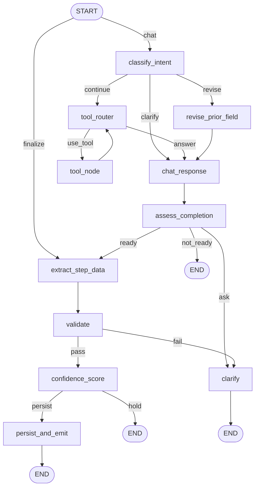

# AI graph contracts

The node-by-node contract for the two LangGraph flows. `graphContract.contract.test.ts` fails CI if a
node or named route predicate registered in either graph is missing here, so this file cannot silently
fall behind the code. See [`spec.md`](spec.md) for scope and
[ADR-016](../../../adr/016-langgraph-course-builder.md) for the decision-level view.

## courseAI — nodes

| Node | Purpose | Reads | Writes | Out | Model | Failure |
|---|---|---|---|---|---|---|
| `classify_intent` | classifies the turn as continue / revise / clarify | `history`, `userMessage`, `currentStep` | `intent`, `reviseTarget` | `routeByIntent` | gpt-4o-mini, structured | swallowed locally → falls back to `continue` |
| `revise_prior_field` | re-extracts and persists a completed step | `reviseTarget`, `content`, `history`, `userMessage`, `generationId` | `content`, `assistantText` | `chat_response` | gpt-4o-mini, structured | propagates (model + DB update) |
| `tool_router` | decides whether a tool call is needed | `currentStep`, `content`, `history`, `userMessage`, `messages` | `toolCalls`, `pendingToolCalls`, `messages` | `routeAfterToolRouter` | gpt-4o-mini, tool-bound | propagates |
| `tool_node` | LangGraph prebuilt `ToolNode`; runs the four course tools | `messages` (last AIMessage), `config.configurable.instructorId` | `messages` (tool results) | `tool_router` | only inside `validateCurriculumCoherence` | tools catch internally and return `{ error }` as output; a hung call has no timeout |
| `chat_response` | streams the reply across four prompt branches | `userMessage`, `currentStep`, `content`, `intent`, `history` | `assistantText` | `assess_completion` | gpt-4o-mini, streaming | propagates; a mid-stream drop loses the partial reply |
| `assess_completion` | decides ready / not ready / ask | `userMessage`, `intent`, `history` (step-filtered), `currentStep`, `assistantText` | `assessReady`, `assessClarify` | `routeAfterAssess` | gpt-4o-mini, structured | swallowed locally → falls back to `assessReady: false` |
| `extract_step_data` | extracts step data on a relaxed schema | `currentStep`, `history` (step-filtered), `assistantText`, `userMessage`, `content` | `draftStepData` | `validate` | gpt-4o-mini, structured | propagates (rate limit, parse failure) |
| `validate` | full Zod validation of the draft | `currentStep`, `draftStepData` | `validationErrors` | `routeAfterValidate` | none | does not throw — invalid data routes to `clarify` |
| `confidence_score` | scores completeness, sets auto-advance | `draftStepData`, `history` (step-filtered, ADR-016), `userMessage`, `assistantText`, `currentStep`, `validationErrors` | `confidence`, `shouldAutoAdvance` | `routeAfterConfidence` | gpt-4o-mini, structured | propagates — no local fallback |
| `clarify` | streams one clarifying question | `validationErrors`, `assessClarify`, `currentStep`, `draftStepData`, last 4 `history`, `userMessage` | `assistantText` | END | gpt-4o-mini, streaming | propagates |
| `persist_and_emit` | commits the step and its transition message | `draftStepData`, `generationId`, `currentStep` | nothing — the effect is the DB write | END | none | propagates; the transaction prevents a partial step |

## courseAI — route predicates

| Predicate | Branches on | Labels → target |
|---|---|---|
| `routeByMode` | `mode` | `finalize` → `extract_step_data`; `chat` → `classify_intent` |
| `routeByIntent` | `intent` | `revise` → `revise_prior_field`; `clarify` → `chat_response`; `continue` → `tool_router` |
| `routeAfterToolRouter` | `pendingToolCalls.length` | `use_tool` → `tool_node`; `answer` → `chat_response` |
| `routeAfterAssess` | `assessReady`, `assessClarify` | `ready` → `extract_step_data`; `ask` → `clarify`; `not_ready` → END |
| `routeAfterValidate` | `validationErrors` | `pass` → `confidence_score`; `fail` → `clarify` |
| `routeAfterConfidence` | `mode`, `shouldAutoAdvance` | `persist` → `persist_and_emit`; `hold` → END |

`routeAfterToolRouter` reads `pendingToolCalls`, which `tool_router` overwrites every pass — reading
the accumulating `toolCalls` instead loops forever.

## courseAI — flow

## Failure matrix

| Scenario | System behavior | What the instructor sees | Persisted |
|---|---|---|---|
| Confidence `< 0.8` | `routeAfterConfidence` returns `hold`; the graph ends without `persist_and_emit` | the reply, a confidence badge, and an explicit Accept button | nothing until Accept |
| Validation failure | `validate` writes `validationErrors`; `routeAfterValidate` sends `fail` to `clarify` | a clarifying question naming what is missing — not an error | nothing |
| Tool call never returns | no timeout exists anywhere on this path; the SSE stream stays open until the client aborts | an indefinite in-progress indicator | nothing — the abort path skips the assistant save |
| Invalid structured output | `withStructuredOutput` throws `OUTPUT_PARSING_FAILURE`; `withNodeErrors` classifies it `FatalNodeError` | "Failed to generate AI response" | the user message only, saved in the route's `finally` |
| Guard block | the route returns before the graph is entered — see [`../ai-input-trust-boundary/spec.md`](../ai-input-trust-boundary/spec.md) | a neutral refusal | nothing |

A retryable failure (provider timeout, rate limit, 5xx) is the sixth case and behaves as the fourth
except that the instructor is told to try again and `retryable: true` rides on the `error` event. A
client abort is not a failure at all: `withNodeErrors` rethrows it untouched and logs nothing, so it
never enters the failure signal.

## learningPathAI

| Node | Purpose | Reads | Writes | Failure |
|---|---|---|---|---|
| `loadStudentSignal` | loads enrollment, lesson order, attempts, mastery | `studentId`, `courseId` | `completedLessonIds`, `lessonOrder`, `quizAttempts`, `mastery` | `CourseUnavailableError` (400) |
| `identifyWeakSignals` | derives weak concepts and failed quizzes | `completedLessonIds`, `mastery`, `lessonOrder`, `quizAttempts` | `weakConcepts`, `failedQuizzes` | cannot fail |
| `decideStrategy` | route predicate: `hasWeak` / `ready` / `empty` | `completedLessonIds`, `quizAttempts`, `weakConcepts`, `failedQuizzes` | — | cannot fail |
| `setSkipLLM` (`setSkipLLMIfEmpty`) | marks a no-history student for the deterministic path | `completedLessonIds`, `quizAttempts` | `skipLLM` | cannot fail |
| `proposeReviews` | up to 3 reviews + 2 quiz retries | `weakConcepts`, `failedQuizzes` | `candidateSteps` | cannot fail |
| `proposeNewLessons` | up to 3 next-in-sequence lessons | `completedLessonIds`, `candidateSteps`, `lessonOrder` | `candidateSteps` | cannot fail |
| `mergeAndExplain` | final path + summary, model or deterministic | `skipLLM`, `candidateSteps`, `weakConcepts`, `lessonOrder`, `reflectionFeedback` | `finalSteps`, `generatedWeakConcepts`, `summary` | `LearningPathInvalidError` after 3 failed semantic validations |
| `reflectAndCheck` | critic; loops back with feedback, capped at 2 | `reflectionAttempt`, `finalSteps`, `weakConcepts`, `completedLessonIds` | `reflectionFeedback`, `reflectionAttempt` | model error propagates unguarded |

`learningPathAI` has no `withNodeErrors`: its nodes throw domain errors that reach tRPC through
`handleServiceError`, so retryable/fatal typing does not apply to this graph. The loop edge out of
`reflectAndCheck` is an inline predicate rather than a named one — it returns to `mergeAndExplain`
while `reflectionFeedback` is set and `reflectionAttempt < 2`, otherwise END.